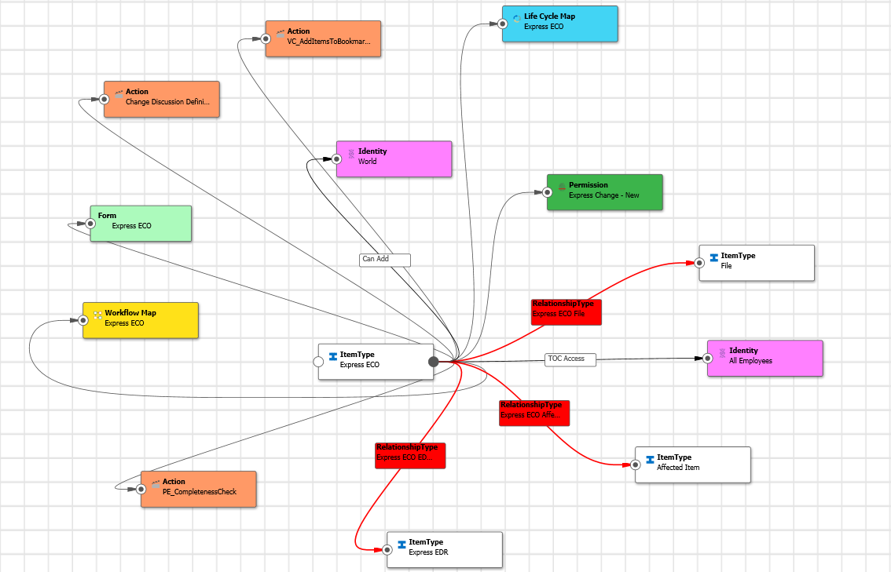
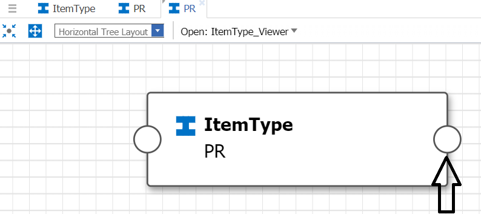
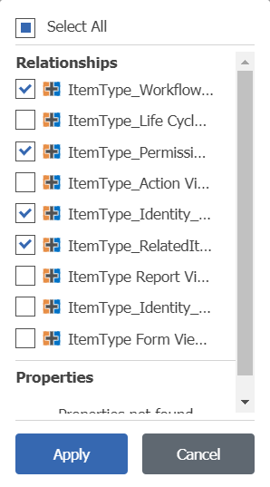

# ItemType Viewer Graph

This package contains a Graph View Definition that visually displays the configuration of any ItemType. 

Once installed, an administrator can display a graph view from any ItemType to see all of the standard configured templates in a single image. 

*This sample shows the default configuration of the Express ECO ItemType.*

## Project Details

Release | Notes
--------|--------
[v1.0.1](https://github.com/ArasLabs/itemtype-graph/releases/tag/v1.0.1) | Fix readme.
[v1.0.0](https://github.com/ArasLabs/itemtype-graph/releases/tag/v1.0.0) | Initial release.

#### Supported Aras Versions

Project | Aras
--------|------
[v1.0.1](https://github.com/ArasLabs/itemtype-graph/releases/tag/v1.0.1) | Aras 11.0 SP15
[v1.0.0](https://github.com/ArasLabs/itemtype-graph/releases/tag/v1.0.0) | Aras 11.0 SP15

## Installation

#### Important!
**Always back up your code tree and database before applying an import package or code tree patch!**

### Pre-requisites

1. Aras Innovator installed (version 11.0 SP15)
2. Aras Package Import Utility
3. GraphNavItemTypeViewer package

### Install Steps

1. Backup your database and store the BAK file in a safe place.
2. Open up the Aras Package Import tool.
3. Enter your login credentials and click **Login**
    * _Note: You must login as root for the package import to succeed!_
4. Enter the package name in the TargetRelease field.
    * Optional: Enter a description in the Description field.
5. Enter the path to your local `..\itemtype-graph\Import\imports.mf` file in the Manifest File field.
6. Select the following in the Available for Import field.
    * **GraphNavItemTypeViewer**
7. Select Type = **Merge** and Mode = **Thorough Mode**.
8. Click **Import** in the top left corner.
9. Close the Aras Package Import tool.

You are now ready to login to Aras and check out the ItemType_Viewer graph view.

## Usage

1. Login to Innovator as an admin.
2. Navigate to **Administration > ItemTypes** in the TOC.
3. Search for the ItemType you want to view in the graph.
4. Right click the ItemType in the main grid and choose **Show Graph** form the context menu.
5. When the graph view opens in a new tab, select **ItemType_Viewer** from the dropdown list in the toolbar.
6. When the ItemType_Viewer graph view appears, click the node connector button to expand the ItemType configuration.

*Click the node connector to expand the structure.*

Once the view is expanded, you can use the Mouse wheel to zoom in and out and choose the various graph view layouts to show the results in different ways.

You can also right click on the starting node connector button to filter the output.

*Right-click the node connector to filter which relationships and properties will be displayed.*

## Contributing

1. Fork it!
2. Create your feature branch: `git checkout -b my-new-feature`
3. Commit your changes: `git commit -am 'Add some feature'`
4. Push to the branch: `git push origin my-new-feature`
5. Submit a pull request

For more information on contributing to this project, another Aras Labs project, or any Aras Community project, shoot us an email at araslabs@aras.com.

## Credits

Created by Bob Ellis for the Aras training team.

## License

Aras Labs projects are published to Github under the MIT license. See the [LICENSE file](./LICENSE.md) for license rights and limitations.